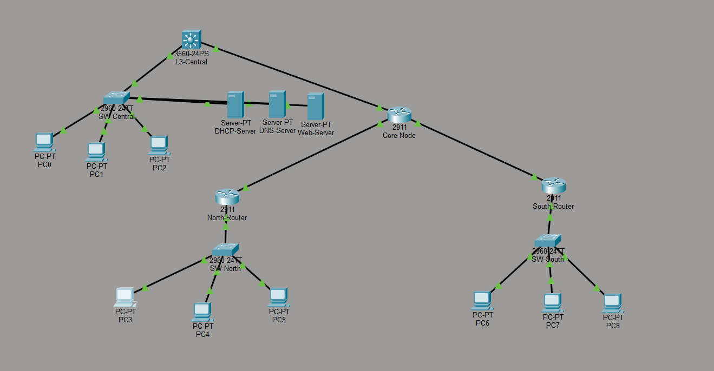
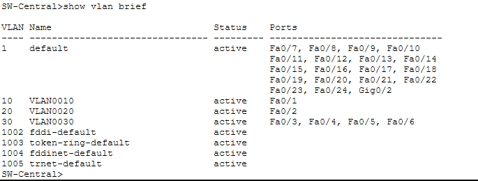
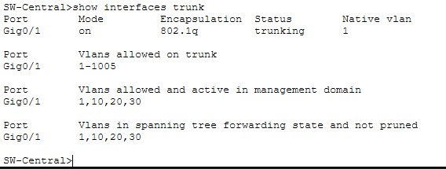
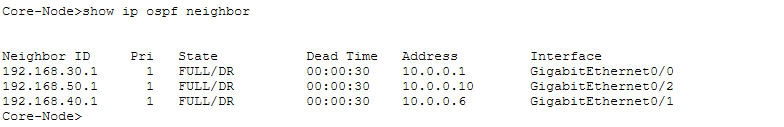
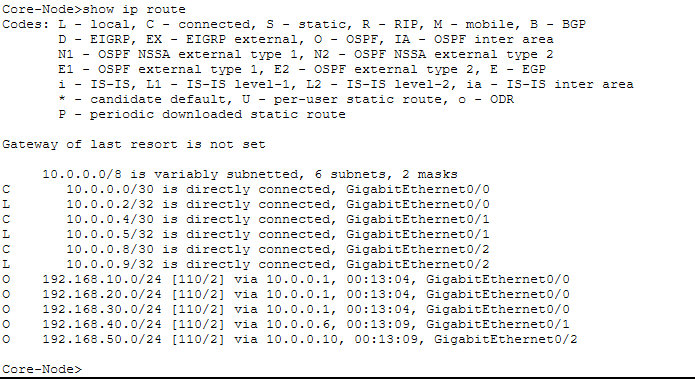
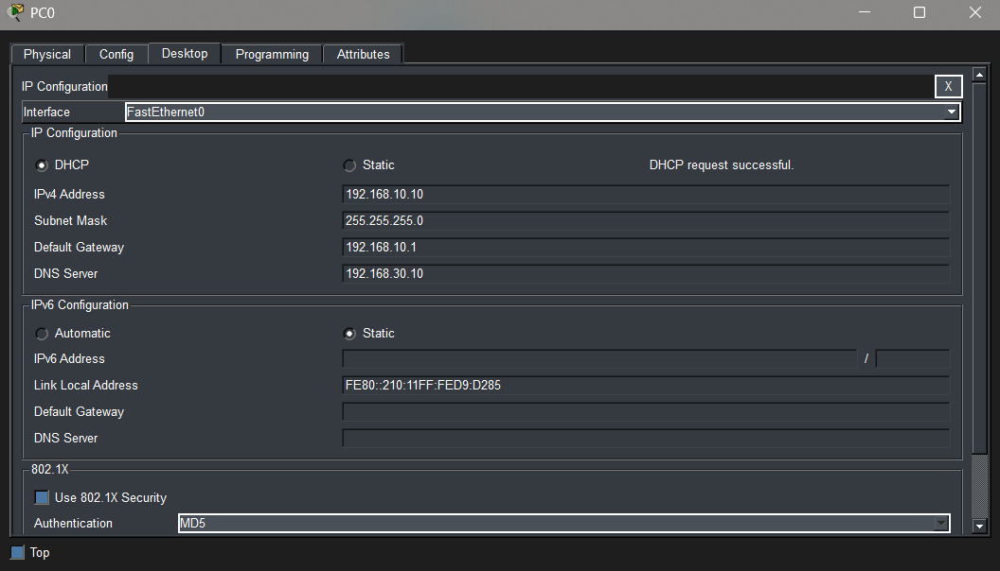
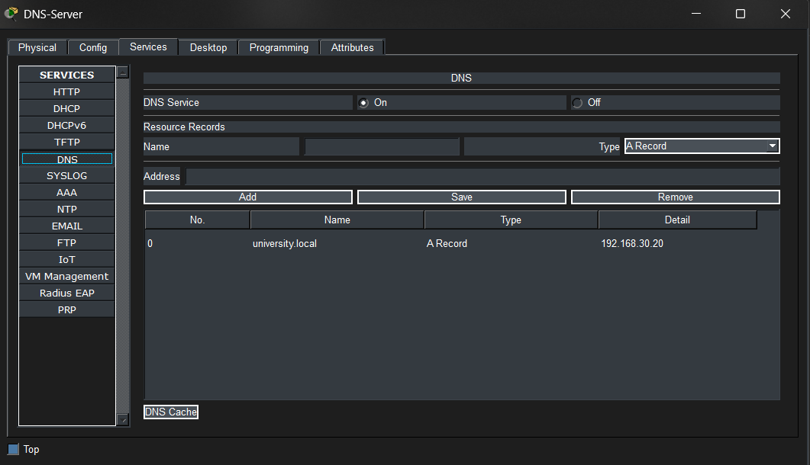
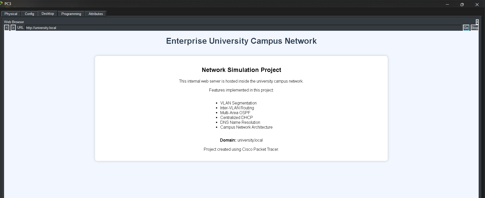

# OSPF Multi-Campus University Network (Cisco Packet Tracer)

## Repository

`ospf-multi-campus-university-network`

## Description

This project simulates an **enterprise-style university campus network** using Cisco Packet Tracer.
It demonstrates **VLAN segmentation, inter-VLAN routing, centralized DHCP/DNS services, and multi-area OSPF routing** across multiple campuses.

The network consists of a **Central Campus connected to North and South campuses through a Core Router**, forming a multi-site campus architecture.

---

# Network Topology

The following topology represents the simulated university campus network.



---

# Devices Used

| Device       | Model      | Role                     |
| ------------ | ---------- | ------------------------ |
| L3-Central   | Cisco 3560 | Inter-VLAN routing       |
| SW-Central   | Cisco 2960 | Central access switch    |
| Core-Node    | Cisco 2911 | Core router              |
| North-Router | Cisco 2911 | North campus gateway     |
| South-Router | Cisco 2911 | South campus gateway     |
| SW-North     | Cisco 2960 | North campus switch      |
| SW-South     | Cisco 2960 | South campus switch      |
| DHCP-Server  | Server     | IP address assignment    |
| DNS-Server   | Server     | Domain name resolution   |
| Web-Server   | Server     | Internal website hosting |

---

# Network Addressing Table

| Network         | Purpose             |
| --------------- | ------------------- |
| 192.168.10.0/24 | Faculty VLAN        |
| 192.168.20.0/24 | Students VLAN       |
| 192.168.30.0/24 | Admin VLAN          |
| 192.168.40.0/24 | North Campus LAN    |
| 192.168.50.0/24 | South Campus LAN    |
| 10.0.0.0/30     | Central ↔ Core link |
| 10.0.0.4/30     | Core ↔ North link   |
| 10.0.0.8/30     | Core ↔ South link   |

---

# VLAN Configuration

Three VLANs were configured on the multilayer switch to segment network traffic.

| VLAN | Name     | Network         |
| ---- | -------- | --------------- |
| 10   | Faculty  | 192.168.10.0/24 |
| 20   | Students | 192.168.20.0/24 |
| 30   | Admin    | 192.168.30.0/24 |

Verification command:

```
show vlan brief
```

Screenshot:



---

# Trunk Configuration

A trunk link was configured between **L3-Central** and **SW-Central** to allow multiple VLANs across the link.

Verification command:

```
show interfaces trunk
```

Screenshot:



---

# OSPF Routing

The network uses **multi-area OSPF routing**.

| Device       | OSPF Area       |
| ------------ | --------------- |
| L3-Central   | Area 0          |
| Core-Node    | Area 0 + Area 1 |
| North-Router | Area 1          |
| South-Router | Area 1          |

Verification command:

```
show ip ospf neighbor
```

Expected state:

```
FULL
```

Screenshot:



---

# Routing Table Verification

Routes learned through OSPF appear in the routing table with the identifier **O**.

Verification command:

```
show ip route
```

Screenshot:



---

# DHCP Configuration

A centralized DHCP server distributes IP addresses to all VLANs and campuses.

Configured DHCP pools:

| Pool     | Network      |
| -------- | ------------ |
| FACULTY  | 192.168.10.0 |
| STUDENTS | 192.168.20.0 |
| ADMIN    | 192.168.30.0 |
| NORTH    | 192.168.40.0 |
| SOUTH    | 192.168.50.0 |

PC verification:

Desktop → IP Configuration → DHCP

Screenshot:



---

# DNS Configuration

The DNS server resolves the internal domain used in the project.

Domain:

```
university.local
```

Mapping:

```
university.local → 192.168.30.20
```

Screenshot:



---

# Web Server

The internal web server hosts a webpage describing the network project.

Access from any PC browser:

```
http://university.local
```

Screenshot:



---

# Configuration Files

Device configurations exported from Packet Tracer are stored in the **configs directory**.

```
configs/
├── l3-central.txt
├── sw-central.txt
├── core-node.txt
├── north-router.txt
└── south-router.txt
```

These files contain the **running configuration of each device**.

---

# Troubleshooting

During the project implementation several configuration issues were encountered and resolved.

* PCs in the **South Campus initially failed to obtain DHCP addresses**. The issue was diagnosed as a missing DHCP relay and resolved by adding `ip helper-address 192.168.30.5` on the South router interface.

* Packet Tracer sometimes connected **FastEthernet instead of Gigabit interfaces** when using Auto Cable. This was resolved by manually selecting the intended `Gi` interfaces during cable connections.

* The **web server initially displayed the default Cisco Packet Tracer page**, which was replaced by editing the `index.html` file inside the HTTP service and adding a custom webpage.

* DHCP pools were verified to ensure that the **correct gateway, subnet mask, and DNS server matched each campus network**, after which IP assignment worked correctly across all campuses.

---

# Repository Structure

```
ospf-multi-campus-university-network
│
├── screenshots
│   topology.png
│   vlan-config.png
│   trunk-link.png
│   ospf-neighbours.png
│   routing-table.png
│   dhcp-working.png
│   dns-record.png
│   web-access.png
│
├── configs
│   l3-central.txt
│   sw-central.txt
│   core-node.txt
│   north-router.txt
│   south-router.txt
│
├── ospf-university-campus-network.pkt
│
└── README.md
```

---

# Author

Akshay Kumar
